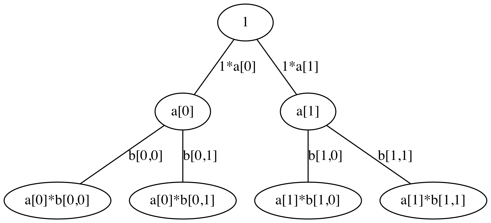

# Differentiable XGBoost 
This is an implementation of a differentiable version of the XGBoost algorithm.

The XGBoost algorithm generates a binary decision tree in order to classify the data. The loss function is minimized by changing the leaf weights of the decision trees. This project implements a model where not only the leaf weights are differentibale but the complete tree. This work is based on some earlier work regarding differentiable decison trees, see [References](#References).

## Run
To start training the differentiable XGBoost model, you need to execute the following command:
```Shell
python run_differentiable_xgboost.py
```

## Key Concepts

### Binary Tree
The XGBoost algorithm is based on binary splits. The model that is implemented in this project has to mimick this behavior. The operations are decribed below.

#### Level 0

Node level 0

``` Python
[
    1
]
```

Split level 0
``` Python
[
    [a[0,0], a[0,1]] # a[0][0] = left; a[1][0] = right 
]
```

Nodes level 1
``` Python
[
    [1 * a[0,0], 1 * a[0,1]]
]
```

#### Level 1


Before the next split the node values `a` are flattened.

Nodes level 1

``` Python
[
    a[0],  # a[0] = left
    a[1]   # a[1] = right 
]
```

Split level 1
``` Python
[
    [b[0,0], b[0,1]], # Split for a[0]: b[0,0] = left, b[0,1] = right 
    [b[1,0], b[1,1]]  # Split for a[1]: b[1,0] = left, b[1,1] = right 
]
```

Nodes level 2
``` Python
[
    [a[0] * b[0,0], a[0] * b[0,1]],
    [a[1] * b[1,0], a[1] * b[1,1]]
]
```

The value of the next node is computed as follows:
``` Python
value[i,j] = a[i]*b[i,j]
```
One way to implement it in TensorFlow is using Einsum
``` Python
tf.einsum('bi,bij->bij')
```

#### Level 2
Nodes level 1
``` Python
[
    a[0] * b[0,0], 
    a[0] * b[0,1], 
    a[1] * b[1,0], 
    a[1] * b[1,1]
]
```

Split level 1
``` Python
[
    [c[0,0], c[0,1]], # Split for a[0] * b[0,0]
    [c[1,0], c[1,1]]  # Split for a[0] * b[0,1]
    [c[2,0], c[2,1]]  # Split for a[1] * b[1,0]
    [c[3,0], c[3,1]]  # Split for a[1] * b[1,1]
]
```

Nodes level 2
``` Python
[
    a[0] * b[0,0] * c[0,0], a[0] * b[0,0] * c[0,1]
    a[0] * b[0,1] * c[1,0], a[0] * b[0,1] * c[1,1]
    a[1] * b[1,0] * c[2,0], a[1] * b[1,0] * c[2,1]
    a[1] * b[1,1] * c[3,0], a[1] * b[1,1] * c[2,1]
]
```

#### Leaves Weights

Lets assume the tree has a depth of `2` then there are `4` leaf nodes. 
``` Python
[
    l[0], 
    l[1], 
    l[2], 
    l[3]
]
```

If there are `2` classes then the weights matrix looks as follows:

``` Python
[
    w[0,0], w[0,1]
    w[1,0], w[1,1]
    w[2,0], w[2,1]
    w[3,0], w[3,1]
]
```

Output of the tree is the dot product of the leaf nodes and the weights matrix:
``` Python
[
    l[0] * w[0,0] + l[1] * w[1,0] + l[2] * w[2,0] + l[3] * w[3,0],
    l[0] * w[0,1] + l[1] * w[1,1] + l[2] * w[2,1] + l[3] * w[3,1]
]
```

The output equals the output of XGBoost when e.g. `l[1], l[2], l[3]` are `0` and
only `l[0]` is `1`:
``` Python
[
    l[0] * w[1,0],
    l[0] * w[0,0]
]
```


### Search Best Feature and Threshold
The XGBoost algorithm uses a for loop to find the best feature with the best threshold. For prediction the optimal threshold is then compared with the feature value. These operations also have to be implemented by the differentiable XGBoost model.

1. Select a feature (Example with two features)

``` Python
features = [[-0.998, 0.91723]]
feature_selection = [[0.08], [0.92]]
selected_feature = matmul([[-0.998, -0.9995]], [[0.08], [0.92]])
selected_feature = [[-0.998 * 0.08 + (-0.9995) * 0.92]] = [[-0.99938]]
```

2. Apply the threshold on the feature value
```Python
selected_feature = [[-0.99938]]
sigmoid(temperature) = [1.0]
threshold = [0.0]
decisions = sigmoid(([[-0.99938]] + [0.0]) / [1.0]
```

## Results
The performance of the model compared to other baseline models can be found [here](README_RESULTS.md).

## References

| Title | Year | Differences |
| - | - | - |
| [Deep Neural Decision Forests](https://www.cv-foundation.org/openaccess/content_iccv_2015/papers/Kontschieder_Deep_Neural_Decision_ICCV_2015_paper.pdf) | 2015 |Probabilistic routing, i.e. no feature selection and no thresholds
| [Neural Decision Trees](https://arxiv.org/pdf/1702.07360.pdf) | 2017 | -
| [Deep Neural Decision Trees](https://arxiv.org/abs/1806.06988)| 2018 | None binary splits; each feature has its own neural network
| [Neural Oblivious Decision Ensembles for Deep Learning on Tabular Data](https://arxiv.org/abs/1909.06312) | 2019|Different initialization; left and right child nodes use same parameters; sigmoid function is not applied on temperature

